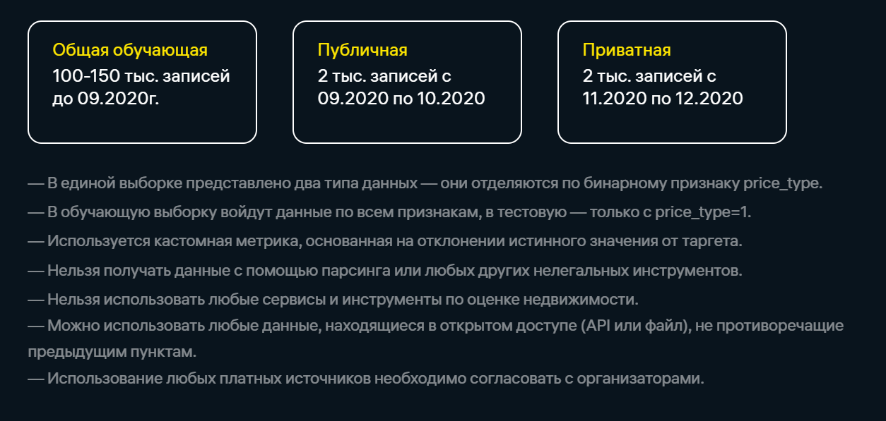

# Онлайн-хакатон Райффайзенбанка "Raifhack DS"

## Задача
### На основании данных о продаже коммерческой недвижимости построить модель, прогнозирующую изменение цен
## Данные 
### Продажи коммерческой недвижимости за 2019 и 2020 год, состоящие из трех частей:
### 
## Требуемый результат и формат решения
### Результат: Прогноз стоимости коммерческой недвижимости на конец 2020 года
### Формат решения: Csv-файл с ответами (id, цена) и восроизводимый zip-архив с решениями.
## Авторы

### :boy: Ямолдин Александр
####    [:email:](aayamoldin@gmail.com)

### :woman: [Анастасия Алексеева](https://github.com/Vlastellin)
